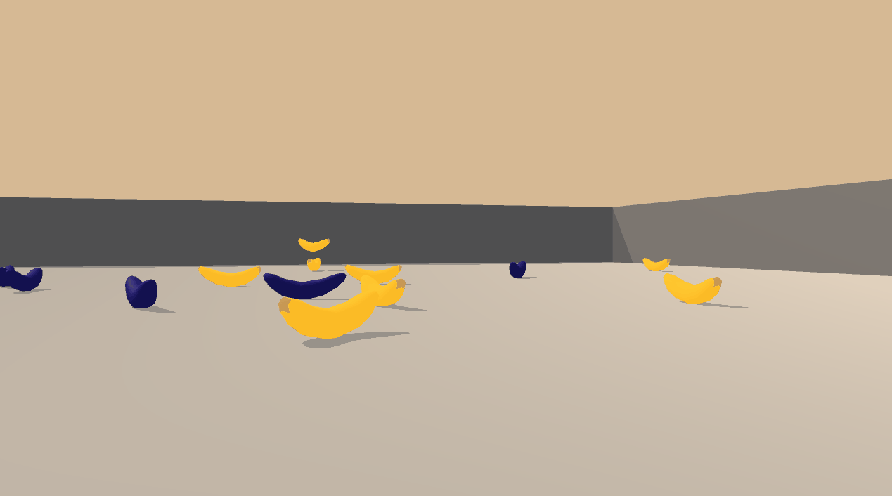

# Udacity Deep Reinforcement Learning Nanodegree
## Project 1 - Banana Navigation :banana:

This is the first project for the Udacity Deep Reinforcement Learning Nanodegree. The goal is to implement model based on [Deep Q-Network (DQN)](https://deepmind.com/research/dqn/) to collect yellow bananas and avoid blue bananas in Unity ML-Agents environment. 


## Environment description

The simulation contains a single agent navigating in a large, square environment.

A reward of +1 is provided for collecting a yellow banana, and a reward of -1 is provided for collecting a blue banana. Thus, the goal of agent is to collect as many yellow bananas as possible while avoiding blue bananas.

The state space has **37 dimensions** and contains the agent's velocity, along with ray-based perception of objects around the agent's forward direction. Given this information, the agent has to learn how to best select actions. **Four discrete actions** are available:

- `0` - walk forward 
- `1` - walk backward
- `2` - turn left
- `3` - turn right

The task is episodic, and in order to solve the environment, your agent must get an average score of **+13** over 100 consecutive episodes.

## Installation and usage guide

1. Prepare new Conda environment following guidelines on [Udacity DRL repo](https://github.com/udacity/deep-reinforcement-learning#dependencies) 

:warning: You may encounter PyTorch installation issues on Windows 10. Looks like required version of PyTorch must be installed using conda: `conda install pytorch=0.4.0 -c pytorch` before running `pip install` in Point 3.


2. Download custom Banana environment (Unity ML-Agents env) prepared by Udacity

Linux: [click here](https://s3-us-west-1.amazonaws.com/udacity-drlnd/P1/Banana/Banana_Linux.zip)
Mac OSX: [click here](https://s3-us-west-1.amazonaws.com/udacity-drlnd/P1/Banana/Banana.app.zip)
Windows (32-bit): [click here](https://s3-us-west-1.amazonaws.com/udacity-drlnd/P1/Banana/Banana_Windows_x86.zip)
Windows (64-bit): [click here](https://s3-us-west-1.amazonaws.com/udacity-drlnd/P1/Banana/Banana_Windows_x86_64.zip)

The file needs to placed in the root directory of this repository and unzipped.

Path to the executable has to be provided to `UnityEnvironment` function in `Navigation.ipynb` 

For example on 64-bit Windows:
```python
env = UnityEnvironment(file_name="./Banana_Windows_x86_64/Banana.exe")
```

3. Run the `Navigation_Project.ipynb` notebook to either train the DQN agent from scratch or use the already trained model weights in the file `model.pth`.

4. You can see how trained agent move in environment by running the last cell in the notebook.
